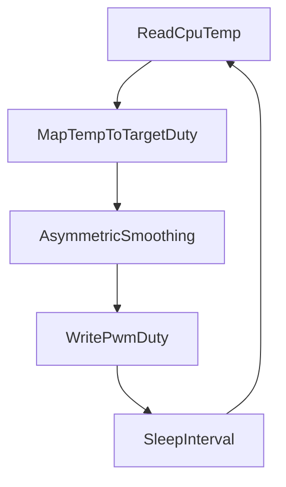

# Raspberry Pi Fan Controller Plan

## Goal
Create a production-ready Rust service for Raspberry Pi OS 64-bit that controls a Noctua NF-A4x10 5V PWM fan using temperature feedback, with fast ramp-up, slow ramp-down behavior, configurable settings, and GitHub-based build/release publishing.

## Implementation Scope
- Initialize a new Rust binary project at [Cargo.toml](Cargo.toml) and [src/main.rs](src/main.rs).
- Read CPU temperature from Linux thermal sysfs (`/sys/class/thermal/thermal_zone0/temp`) and drive PWM via GPIO (with your transistor/open-drain wiring approach).
- Use a config file for runtime tuning (PIN, thresholds, PWM limits, timing, control constants), loaded from `/etc/rpi-fan-control/config.toml` with fallback to local config for development.
- Keep runtime overhead very low to avoid impacting normal Pi workloads.

## Control Strategy (Smooth + Asymmetric)
- Implement a target-speed curve based on temperature breakpoints (piecewise linear), e.g. off/low/mid/high/full thresholds from config.
- Apply **asymmetric smoothing**:
  - Rising temperature/speed: higher response factor and larger max step per update.
  - Falling temperature/speed: lower response factor and smaller max step per update.
- Add hysteresis and clamping (min/max duty) to avoid oscillation and guarantee stable behavior.
- Run a periodic loop (default 1s; configurable) with structured logs and fail-safe behavior.

## Performance Constraints (Low Impact on RPi4)
- Prefer integer/fixed-point math in the control loop to avoid unnecessary floating-point work.
- Use a single-threaded loop with preallocated state and no per-tick heap allocations.
- Read only required sysfs files each tick and avoid spawning subprocesses.
- Write PWM duty only when the value meaningfully changes (deadband), reducing GPIO churn.
- Keep logging minimal in steady state (info on startup/config, debug for periodic telemetry).
- Add config knobs for loop interval and optional telemetry interval so users can tune CPU impact.
- Include a lightweight benchmark/check target in CI for the mapping/smoothing logic to catch regressions.

## Service + Packaging
- Add deployment assets:
  - [packaging/rpi-fan-control.service](packaging/rpi-fan-control.service) (systemd unit)
  - [packaging/config.toml.example](packaging/config.toml.example)
  - optional [packaging/rpi-fan-control.default](packaging/rpi-fan-control.default) for env overrides.
- Ensure service runs as root (or a dedicated service user with GPIO permissions) and restarts on failure.
- Include install steps to place binary in `/usr/local/bin/rpi-fan-control` and config in `/etc/rpi-fan-control/config.toml`.

## Documentation
- Create/expand [README.md](README.md) with:
  - hardware wiring notes for Noctua PWM + transistor/open-drain signal path,
  - config reference (PIN, thresholds, smoothing/ramp params, loop interval),
  - local run instructions,
  - full systemd setup instructions (`daemon-reload`, `enable --now`, logs, troubleshooting),
  - safety notes and recommended default profile.

## GitHub Build + Publish
- Add CI workflow at [.github/workflows/ci.yml](.github/workflows/ci.yml) for fmt, clippy, tests, and release build.
- Add release workflow at [.github/workflows/release.yml](.github/workflows/release.yml) to publish ARM artifacts on tags (binary tarball and/or .deb).
- Add release notes template and version/tag convention in README.

## Validation
- Add basic tests for temperature-to-duty mapping and asymmetric smoothing behavior in [src/control.rs](src/control.rs).
- Add a dry-run mode (or mock PWM backend) for validation without fan hardware.
- Define manual verification checklist: idle temp behavior, heat-up response, cooldown decay, and service reboot persistence.
- Record expected resource footprint target in README (very low idle CPU and memory) and validate on-device with `systemd-cgtop`/`top`.